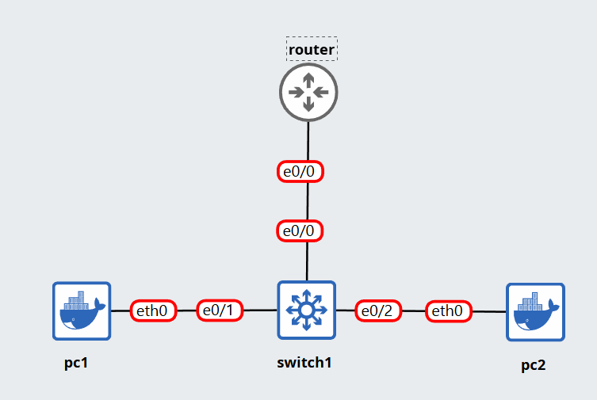
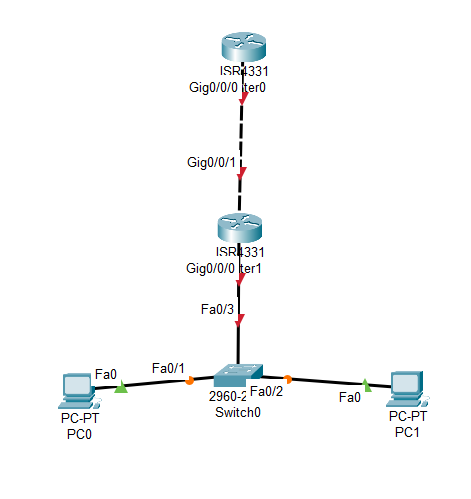

# Topology

# Config
## router
```
! 1. กัน IP ที่ไม่ต้องการแจก (เช่น IP ของ Router เอง หรือ Server)
(config)# ip dhcp excluded-address 192.168.10.1 192.168.10.10

! 2. สร้าง DHCP Pool
(config)# ip dhcp pool MY_LAN
(dhcp-config)# network 192.168.10.0 255.255.255.0
(dhcp-config)# default-router 192.168.10.1
(dhcp-config)# dns-server 8.8.8.8
(config-if)# exit

! 3. ตั้งค่า IP ให้ขา Interface ของ Router (Gateway)
interface e0/0
 (config-if)# ip address 192.168.10.1 255.255.255.0
 (config-if)# no shutdown
 (config-if)# exit
 (config)# show ip dhcp binding
```

# Bonus

## Router1
```cisco
(config)# int g0/0/0
(config)# ip helper-address [ip_router0]
```