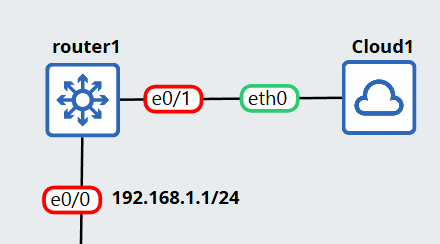

# Topology

# Config
## Static Nat
```cisco
(config)# ip nat inside source static [local IP] [Global IP]
(config)# int e0/0
(config)# ip nat inside
(config)# int e0/1
(config)# ip nat outside
```

## Dynamic NAT
```cisco
(config)# ip nat pool NAT_POOL [start_public_ip] [end_public_ip] netmask [subnet_mask]
(config)# access-list 1 permit [network_id] [wildcard]
(config)# ip nat inside source list 1 pool MY_POOL
(config)# int e0/0
(config)# ip nat inside
(config)# int e0/1
(config)# ip nat outside
```
## PAT
```cisco
(config)# access-list 1 permit [network_id] [wildcard]
(config)# ip nat inside source list 1 interface [outside_interface] overload
(config)# int e0/0
(config)# ip nat inside
(config)# int e0/1
(config)# ip nat outside
```